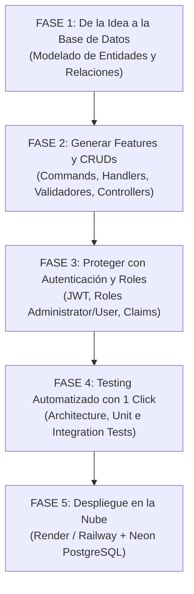

# ⚡ THE VIBECODER PLAYBOOK & PROMPT PACK
## Guía de Desarrollo Acelerado con IA para el Enterprise .NET 10 Starter Kit
**Diseñado para:** Vibecoders, Founders No-Code/Low-Code, Desarrolladores Ágiles y Creadores de SaaS  
**Compatibilidad IA:** Cursor AI, Windsurf, Claude 3.7 / 3.5 Sonnet, ChatGPT (GPT-4o/o3), GitHub Copilot, Antigravity  
**Versión:** 1.0.0 Enterprise Edition  

---

## 🎯 ¿QUÉ ES ESTA GUÍA?

Como **Vibecoder**, tu superpoder es convertir ideas en productos funcionales a la velocidad de la luz usando IA. Sin embargo, las IAs suelen cometer errores graves en el backend si no tienen una estructura sólida: crean controladores gigantes, olvidan la seguridad de los tokens, mezclan capas y rompen la base de datos.

Este **Starter Kit Enterprise** ya resolvió el 90% del trabajo pesado de ingeniería (Clean Architecture, JWT con Refresh Tokens, PostgreSQL 17, Scalar API Docs, Docker y Seguridad OWASP).

Esta guía te da los **Mega-Prompts de Copiar y Pegar** diseñados para que tu IA favorita construya tus módulos, modele tu base de datos, configure la seguridad y despliegue tu API en minutos **sin romper ninguna regla técnica**.

---

## 🧭 EL MAPA DE RUTA DEL VIBECODER (DE LA IDEA A PRODUCCIÓN)



---

## 🤖 PROMPT MAESTRO (CONFIGURACIÓN INICIAL DEL PROYECTO / `.cursorrules`)

> [!IMPORTANT]
> **Paso 0:** Copia y pega este prompt en el archivo `.cursorrules`, en las instrucciones de tu proyecto en Windsurf, o en el System Prompt de tu chat con IA. Esto le enseñará a la IA las reglas estrictas de este Starter Kit.

```markdown
Eres un Arquitecto de Software Senior especializado en .NET 10, C# 13 y Clean Architecture.
Estamos trabajando sobre una base de código estructurada con Clean Architecture y CQRS (MediatR).

REGLAS ESTRICTAS QUE DEBES CUMPLIR SIEMPRE:
1. ESTRUCTURA DE CAPAS:
   - BackendTemplate.Domain: Entidades puras (heredando de AuditableEntity y ISoftDeletable), Result<T>, Error, Enums. Cero dependencias externas.
   - BackendTemplate.Application: Casos de uso (Features/NombreEntidad/Commands o Queries). Interfaces (IApplicationDbContext, IIdentityService), validadores FluentValidation, pipeline behaviors.
   - BackendTemplate.Infrastructure: Implementación de EF Core, PostgreSQL (Npgsql), Identity, interceptores y configuraciones Fluent API.
   - BackendTemplate.Api: Controladores heredando de ApiControllerBase, middlewares, Program.cs. No pongas lógica de negocio en los controladores.

2. PATRÓN RESULT & ERRORES:
   - Todos los Handlers deben retornar Result o Result<T>.
   - Usa Error.NotFound(), Error.Validation(), Error.Conflict(), Error.Unauthorized(), Error.Forbidden() para fallos semánticos. No arrojes excepciones para flujos normales de negocio.

3. VALIDACIONES:
   - Cada Command debe tener su clase Validator heredando de AbstractValidator<TCommand>. El ValidationBehavior de MediatR los ejecuta automáticamente.

4. PERSISTENCIA:
   - Las entidades se auditan automáticamente (CreatedAt, CreatedBy, LastModifiedAt) y se borran con Soft-Delete vía AuditableEntitySaveChangesInterceptor.
   - En consultas de solo lectura usa .AsNoTracking().

5. API Y DOCUMENTACIÓN:
   - Los controladores heredan de ApiControllerBase y retornan HandleResult(await Mediator.Send(...)).
   - La documentación interactiva se genera automáticamente con Scalar en /scalar/v1.

Cuando te pida una nueva feature, genera siempre el código completo para todas las capas necesarias sin omitir ninguna.
```

---

## 📦 FASE 1: DE TU IDEA AL MODELO DE DATOS

### ¿Cómo funciona la persistencia en este Starter Kit?
* Las entidades van en `BackendTemplate.Domain/Entities/`.
* Heredan de `AuditableEntity` (guarda quién creó/modificó el registro y cuándo) y de `ISoftDeletable` (borrado lógico con `IsDeleted = true`).
* El contrato de la base de datos se actualiza en `BackendTemplate.Application/Common/Interfaces/IApplicationDbContext.cs`.
* La configuración visual de tablas e índices va en `BackendTemplate.Infrastructure/Persistence/Configurations/`.

---

### 📋 PROMPT 1: MODELADO DE BASE DE DATOS PARA TU IDEA
**Usa este prompt cuando tengas una idea y quieras convertirla en entidades de base de datos.**

```markdown
Tengo la siguiente idea de negocio para mi aplicación:
"[DESCRIBE TU IDEA AQUÍ, EJ: Una plataforma de reservas de canchas deportivas donde hay usuarios, canchas, reservas y pagos]"

Actúa como Arquitecto de Datos .NET y genera el modelo de entidades para el Enterprise Starter Kit:
1. Diseña las entidades de dominio necesarias en C# 13 que hereden de `AuditableEntity` e implementen `ISoftDeletable`.
2. Incluye métodos de negocio (ej. Cancelar, Modificar, Pagar) y un constructor claro con encapsulación (`private set`).
3. Agrega las propiedades `DbSet<T>` necesarias para la interfaz `IApplicationDbContext` en Application.
4. Genera las clases de configuración Fluent API en Infrastructure (`IEntityTypeConfiguration<T>`) con tipos de columna PostgreSQL, índices únicos y relaciones (HasOne/HasMany).
5. Dame el código listo para copiar y pegar archivo por archivo.
```

---

## ⚡ FASE 2: GENERACIÓN DE NUEVAS FEATURES / MÓDULOS (CRUD COMPLETO)

### Arquitectura de una Feature en este Starter Kit:
Para cada módulo (ej. `Products`, `Orders`, `Appointments`), creamos una carpeta en `Application/Features/{Nombre}/`:
* `Commands/`: Operaciones de creación, edición y eliminación.
* `Queries/`: Consultas de listado paginado y búsqueda por ID.
* Cada Command/Query tiene:
  1. El modelo `record` (`IRequest<Result<T>>`).
  2. El validador `AbstractValidator<T>`.
  3. El handler `IRequestHandler<T, Result<T>>`.

---

### 📋 PROMPT 2: GENERACIÓN DE CRUD COMPLETO (SLICES VERTICALES)
**Usa este prompt para crear un módulo completo de tu aplicación.**

```markdown
Quiero agregar el módulo/feature "[NOMBRE_DEL_MODULO, EJ: Invoices / Facturas]" a mi backend.

La entidad tiene los siguientes campos:
- [Campo 1, ej: InvoiceNumber (string, único)]
- [Campo 2, ej: CustomerId (Guid)]
- [Campo 3, ej: TotalAmount (decimal > 0)]
- [Campo 4, ej: DueDate (DateTime)]
- [Campo 5, ej: Status (Enum: Pending, Paid, Cancelled)]

Genera el código completo siguiendo estrictamente la arquitectura del Starter Kit:
1. DOMAIN: Entidad de dominio con métodos de negocio y soft-delete.
2. APPLICATION:
   - Create[Modulo]Command + Validator + Handler
   - Update[Modulo]Command + Validator + Handler
   - Delete[Modulo]Command + Validator + Handler (Soft-delete)
   - Get[Modulo]ByIdQuery + Handler + DTO
   - Get[Modulo]WithPaginationQuery + Handler (usando PaginatedResult<T>)
3. INFRASTRUCTURE:
   - Configuración Fluent API con HasQueryFilter(!IsDeleted) e índices.
4. API:
   - [Modulo]Controller heredando de ApiControllerBase con endpoints REST bien nombrados y Swagger/Scalar annotations.

Escribe el código completo, sin placeholders de tipo "// todo" ni código dummy.
```

---

## 🔐 FASE 3: AUTENTICACIÓN, ROLES Y PROTECCIÓN DE ENDPOINTS

### ¿Qué ya incluye el Starter Kit?
* **Login & Registro:** `POST /api/auth/login` y `POST /api/auth/register`.
* **Refresh Tokens:** `POST /api/auth/refresh-token` con rotación atómica y anti-reutilización.
* **Cambio de Contraseña & Revocación:** `POST /api/auth/change-password` y `POST /api/auth/revoke-token`.
* **Roles del Sistema:** `Administrator` y `User`.
* **Servicio de Contexto:** `ICurrentUserService` (te da el `UserId` del usuario que hace la petición).

---

### 📋 PROMPT 3: PROTEGER ENDPOINTS CON AUTENTICACIÓN Y ROLES
**Usa este prompt para proteger cualquier controlador o inyectar el usuario actual en tus handlers.**

```markdown
Necesito proteger los endpoints de mi controlador `[NOMBRE_CONTROLADOR, EJ: OrdersController]` y vincular los datos al usuario que inició sesión.

Requisitos:
1. Solo usuarios autenticados con JWT pueden acceder (`[Authorize]`).
2. El endpoint de eliminación o modificación administrativa debe requerir el rol `Administrator` (`[Authorize(Roles = "Administrator")]`).
3. En el comando de creación, el ID del usuario creador debe obtenerse de `ICurrentUserService.UserId` y no del cuerpo de la petición (por seguridad).
4. En las consultas (Queries), si el usuario es un `User` estándar, solo debe ver sus propios registros; si es `Administrator`, puede ver todos los registros.

Muestra cómo modificar el Controller y el QueryHandler de Application para implementar estas reglas.
```

---

## 🧪 FASE 4: TESTING AUTOMATIZADO CON 1-CLICK

El Starter Kit ya tiene configurado:
* `NetArchTest.Rules`: Verifica que nadie rompa la Clean Architecture.
* `xUnit` + `FluentAssertions`: Pruebas unitarias de validadores y handlers.
* `WebApplicationFactory`: Pruebas de integración HTTP contra endpoints reales.

---

### 📋 PROMPT 4: GENERAR TESTS UNITARIOS Y DE INTEGRACIÓN
**Usa este prompt para crear las pruebas de cualquier nueva feature.**

```markdown
Genera la suite de pruebas automatizadas para el módulo `[NOMBRE_DEL_MODULO, EJ: Products]`:

1. TESTS UNITARIOS (en BackendTemplate.UnitTests):
   - Pruebas para el CommandValidator (probando casos válidos e inválidos como campos vacíos, valores negativos o longitudes excedidas).
   - Pruebas para los Handlers usando `TestDbContextFactory.Create()` (InMemory DB) verificando que devuelvan `Result.Success` o `Result.Failure(Error.NotFound)`.

2. TESTS DE INTEGRACIÓN (en BackendTemplate.IntegrationTests):
   - Prueba HTTP usando `CustomWebApplicationFactory` y la colección `[Collection("IntegrationTests")]`.
   - Verifica que un usuario no autenticado reciba 401 Unauthorized.
   - Verifica que con un payload válido devuelva 200 OK y la estructura `ApiResponse<T>`.

Escribe las pruebas listas para ejecutarse con `dotnet test`.
```

---

## 🚀 FASE 5: DESPLIEGUE EN PRODUCCIÓN EN 5 MINUTOS (RENDER / RAILWAY + NEON)

Para desplegar tu API como un Vibecoder sin gestionar servidores complejos:

### Arquitectura de Despliegue Gratuita / Low-Cost:
* **Base de Datos PostgreSQL Serverless:** [Neon.tech](https://neon.tech) o [Supabase](https://supabase.com) (Plan gratuito).
* **Hosting del Backend API:** [Render.com](https://render.com) o [Railway.app](https://railway.app) (Despliegue directo desde tu repositorio de GitHub usando el `Dockerfile`).

```
[Cliente Web / Móvil] 
         │
         ▼ (HTTPS)
[Render / Railway Web Service] ─── (API .NET 10 en Docker)
         │
         ▼ (SSL Encrypted Connection)
[Neon.tech / PostgreSQL Serverless]
```

---

### 📋 PROMPT 5: ASISTENTE DE DESPLIEGUE EN RENDER / RAILWAY
**Usa este prompt para que la IA te guíe en el despliegue paso a paso según tus proveedores.**

```markdown
Quiero desplegar mi Enterprise .NET Starter Kit en producción usando:
- Backend: [Render.com / Railway.app / Azure App Service]
- Base de datos: [Neon.tech / Supabase / PostgreSQL administrado]

Por favor dame:
1. La lista exacta de Variables de Entorno que debo configurar en el panel de control de Render/Railway (ConnectionStrings, JwtSettings, CorsSettings, ASPNETCORE_ENVIRONMENT).
2. Cómo ajustar la cadena de conexión de Neon/Supabase (incluyendo `SSL Mode=Require;Trust Server Certificate=true;`).
3. El comando o configuración de Dockerfile para que Render compile y ejecute la API con el puerto expuesto (`PORT 8080` / `ASPNETCORE_HTTP_PORTS=8080`).
4. Cómo verificar que las migraciones se ejecutaron automáticamente al iniciar y cómo acceder a la documentación Scalar en producción.
```

---

## 💡 GUÍA RÁPIDA DE CONFIGURACIÓN EN RENDER (PASO A PASO)

1. **Crear Base de Datos en Neon.tech:**
   * Crea un proyecto gratis en [Neon.tech](https://neon.tech).
   * Copia la cadena de conexión de tipo **ADO.NET** o **PostgreSQL Connection String**.

2. **Crear Web Service en Render.com:**
   * Conecta tu repositorio de GitHub.
   * Selecciona **Environment: Docker**.
   * Render detectará automáticamente el [`Dockerfile`](file:///d:/PROYECTOS/LAB-CONTROL/.Net-Started-Kit/backend-template-net/Dockerfile) optimizado del proyecto.

3. **Configurar Variables de Entorno en Render:**
   ```env
   ASPNETCORE_ENVIRONMENT=Production
   ASPNETCORE_HTTP_PORTS=8080
   ConnectionStrings__DefaultConnection=Host=tu-neon-host.neon.tech;Database=neondb;Username=tu_usuario;Password=tu_password;SSL Mode=Require;Trust Server Certificate=true;
   JwtSettings__Secret=MiClaveSuperSecretaYExtremadamenteLargaDeMasDe64CaracteresSeguros123!
   JwtSettings__Issuer=https://tu-api.onrender.com
   JwtSettings__Audience=https://tu-frontend.vercel.app
   JwtSettings__ExpirationMinutes=60
   JwtSettings__RefreshTokenExpirationDays=7
   CorsSettings__AllowedOrigins__0=https://tu-frontend.vercel.app
   Database__ApplyMigrationsOnStartup=true
   ```

4. **¡Listo!**
   Al hacer clic en **Deploy**, Render compilará la imagen Docker multi-etapa, la API se conectará a Neon, ejecutará las migraciones automáticamente, creará el usuario administrador inicial y tu backend estará vivo en HTTPS.

---

## 🛠️ PROMPTS EXTRA PARA CASOS DE USO COMUNES

### 📋 PROMPT EXTRA: AGREGAR UN BACKGROUND JOB / TAREA PROGRAMADA
```markdown
Quiero agregar una tarea programada en segundo plano a mi backend (ej: enviar un reporte diario por email o limpiar tokens vencidos cada medianoche).
Muestra cómo registrar un `IHostedService` / `BackgroundService` en .NET 10 dentro de `BackendTemplate.Infrastructure` que consuma un caso de uso de `BackendTemplate.Application` usando `IServiceScopeFactory`.
```

### 📋 PROMPT EXTRA: SUBIDA DE ARCHIVOS A CLOUD (AWS S3 / CLOUDINARY)
```markdown
Quiero permitir que los usuarios suban imágenes de perfil y documentos PDF.
1. Crea la interfaz `IFileStorageService` en `BackendTemplate.Application/Common/Interfaces/`.
2. Crea una implementación en `BackendTemplate.Infrastructure` usando AWS S3 / Cloudinary.
3. Crea el Command `UploadAvatarCommand` y su endpoint en `UsersController`.
```

---

## 🏆 RESUMEN DE ATAJOS PARA EL VIBECODER

| Acción | Comando / Atajo |
| :--- | :--- |
| **Iniciar DB Local (Postgres + Redis + Mailpit)** | `docker compose up -d postgres redis mailpit` |
| **Ejecutar API Localmente** | `dotnet run --project BackendTemplate.Api` |
| **Abrir Documentación Interactiva** | Navega a `http://localhost:5000/scalar/v1` |
| **Ver Correos de Prueba (SMTP Local)** | Navega a `http://localhost:8025` |
| **Ejecutar Toda la Suite de Pruebas** | `dotnet test` |
| **Probar Peticiones HTTP en VS Code** | Abre el archivo `backend-requests.http` y haz clic en *Send Request* |

---

*The Vibecoder Playbook • Enterprise .NET Starter Kit v1.0.0*
