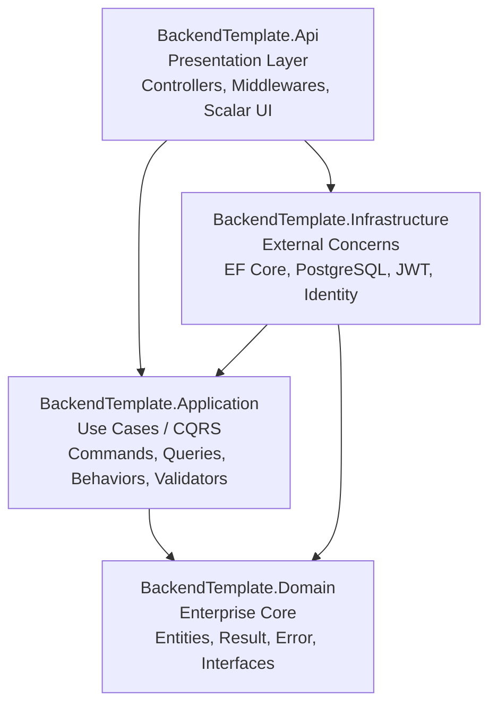
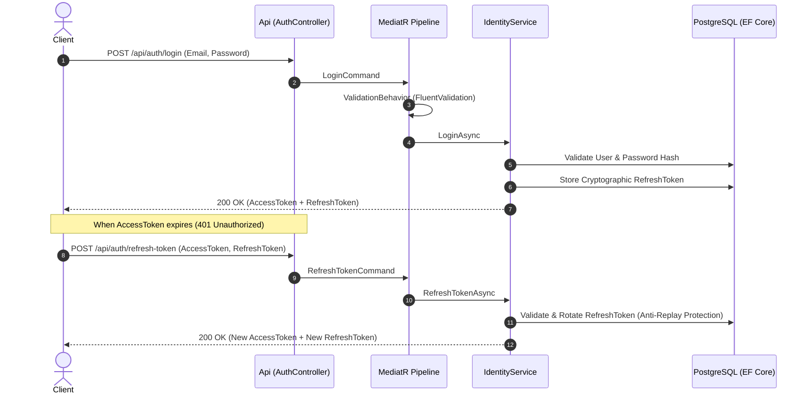

# 🚀 Enterprise .NET Starter Kit (.NET 10 & C# 13)

[](https://dotnet.microsoft.com/)
[](https://blog.cleancoder.com/)
[](https://www.postgresql.org/)
[](https://scalar.com/)
[](https://www.docker.com/)
[](https://owasp.org/)
[](https://xunit.net/)

Production-grade, enterprise-ready **.NET 10 Web API Starter Kit** architected with **Clean Architecture**, **CQRS (MediatR)**, **Entity Framework Core 10**, **ASP.NET Core Identity with Refresh Tokens**, **Polly v8 Resilience**, **Scalar Modern API Reference**, and **OWASP Security Hardening**.

Designed for senior software engineers, technical leads, and software agencies building high-performance SaaS, fintech, enterprise backends, or scalable distributed systems.

---

## 🏛️ Clean Architecture & Design

The solution strictly enforces Clean Architecture boundaries with inward-facing dependencies. Architecture rules are verified automatically on every build through automated unit tests with **NetArchTest**.



### Authentication & Token Lifecycle Flow



---

## ✨ Enterprise Features Matrix

| Category | Features Included |
| :--- | :--- |
| **Core Architecture** | Clean Architecture (Domain, Application, Infrastructure, Api), CQRS with MediatR 14, Domain-Driven Design (DDD) primitives (`Result<T>`, `Error`, `BaseEntity`, `AuditableEntity`, `ISoftDeletable`). |
| **Authentication & AuthZ** | ASP.NET Core Identity + JWT (HMAC-SHA256), Refresh Token rotation & revocation, Role-based authorization (`Administrator`, `User`), Claims enrichment (`firstName`, `roles`, `sub`). |
| **Persistence & EF Core** | PostgreSQL 17 via EF Core 10, Auto-Migrations, Seed Data Initializer, Audit Interceptor (`CreatedAt`, `CreatedBy`, `LastModifiedAt`), Global Soft-Delete Query Filters (`!IsDeleted`). |
| **Resilience & Fault Tolerance** | Polly v8 connection retries on transient database failures (`EnableRetryOnFailure` 3 retries, exponential backoff). Multi-provider DB support (PostgreSQL + InMemory for instant tests). |
| **MediatR Pipeline** | `ValidationBehavior` (automatic FluentValidation execution), `LoggingBehavior` (Serilog timing & context), `PerformanceBehavior` (slow request alerts >500ms), `UnhandledExceptionBehavior`. |
| **Security Hardening** | OWASP Security Headers middleware (`X-Content-Type-Options`, `X-Frame-Options`, `Referrer-Policy`, `Permissions-Policy`, CSP), IP Rate Limiting (`FixedWindow` 100 req/min), CORS policy. |
| **Error Handling** | RFC 7807 `ProblemDetails` via native .NET 10 `IExceptionHandler` (`CustomExceptionHandler`), strongly-typed `ErrorType` mapping (Validation, NotFound, Conflict, Unauthorized, Forbidden). |
| **API Documentation** | **Scalar.AspNetCore** (Modern, interactive Swagger replacement at `/scalar/v1`), Native OpenAPI 3.1 with automated JWT Bearer authorization scheme transformer. |
| **Observability & Logging** | Serilog with structured console and rolling file logging, enriched HTTP request/response metrics, ASP.NET Core Health Checks (`/health` and `/api/health`). |
| **DevOps & Containers** | Production-ready multi-stage `Dockerfile` (distroless/chiseled Ubuntu, non-root user `USER app`), `docker-compose.yml` (PostgreSQL 17, Redis 7, Mailpit SMTP + Web UI, Backend API). |
| **Testing Suite** | 100% test coverage with xUnit, `NetArchTest.Rules` (Architecture validation), `Moq`, `FluentAssertions`, and `WebApplicationFactory` integration tests. |

---

## ⚡ Quick Start in 3 Steps

### Prerequisites
* [.NET 10 SDK](https://dotnet.microsoft.com/download/dotnet/10.0)
* [Docker Desktop](https://www.docker.com/products/docker-desktop/)

### 1. Clone & Launch Infrastructure
```bash
# Clone the repository
git clone https://github.com/your-org/backend-template-net.git
cd backend-template-net

# Start PostgreSQL 17, Redis 7 and Mailpit
docker compose up -d postgres redis mailpit
```

### 2. Run the Application
```bash
dotnet run --project BackendTemplate.Api
```

The database will **auto-migrate and seed** default roles (`Administrator`, `User`), an Admin account, and sample data automatically on initial startup.

### 3. Explore Interactive Documentation & Test Endpoints
* **Scalar API Reference (Interactive Docs):** [http://localhost:5000/scalar/v1](http://localhost:5000/scalar/v1) or [https://localhost:5001/scalar/v1](https://localhost:5001/scalar/v1)
* **Health Check:** [http://localhost:5000/health](http://localhost:5000/health)
* **Mailpit Web UI (Email capture):** [http://localhost:8025](http://localhost:8025)

---

## 🔑 Default Credentials & Roles

| Role | Email | Password | Access Level |
| :--- | :--- | :--- | :--- |
| **Administrator** | `admin@template.com` | `Admin123!` | Full administrative CRUD access |
| **User** | Self-registered via `/api/auth/register` | User-defined | Standard authenticated user |

---

## 📁 Solution Structure

```text
├── BackendTemplate.Domain/              # Core business entities & value objects
│   ├── Common/                         # BaseEntity, AuditableEntity, Result<T>, Error, ISoftDeletable
│   └── Entities/                       # Student, RefreshToken
│
├── BackendTemplate.Application/         # CQRS Handlers, Business Logic & Contracts
│   ├── Common/
│   │   ├── Behaviors/                  # Logging, Performance, Validation, UnhandledException
│   │   ├── Exceptions/                 # ValidationException, NotFoundException, ForbiddenException
│   │   ├── Interfaces/                 # IApplicationDbContext, IIdentityService, ICurrentUserService
│   │   └── Models/                     # AuthModels, PaginatedResult, ApiResponse
│   └── Features/                       # Vertical Feature Slices (Commands, Queries, Validators)
│       ├── Auth/                       # Login, Register, RefreshToken, RevokeToken, ChangePassword
│       ├── Health/                     # Health query handler
│       └── Students/                   # Create, Read, Update, Delete (Soft-delete), Pagination
│
├── BackendTemplate.Infrastructure/      # External implementation details & persistence
│   ├── Identity/                       # ApplicationUser, ASP.NET Core Identity config
│   ├── Persistence/                    # ApplicationDbContext, EF Configurations, Interceptors
│   │   ├── Configurations/             # Fluent API entity configurations
│   │   ├── Interceptors/               # AuditableEntitySaveChangesInterceptor (Audit + Soft Delete)
│   │   └── ApplicationDbContextInitializer.cs # Auto-migrations & Seeder
│   └── Services/                       # IdentityService, DateTimeService, CurrentUserService
│
├── BackendTemplate.Api/                 # Delivery Mechanism & Web API
│   ├── Controllers/                    # AuthController, StudentsController, HealthController
│   ├── Middlewares/                    # CustomExceptionHandler (RFC 7807), SecurityHeadersMiddleware
│   ├── OpenApi/                        # BearerSecuritySchemeTransformer
│   └── Program.cs                      # Application composition root & DI
│
├── tests/
│   ├── BackendTemplate.UnitTests/      # Architecture tests (NetArchTest), Handlers, Validators
│   └── BackendTemplate.IntegrationTests/ # Full pipeline HTTP integration tests (WebApplicationFactory)
│
├── docker-compose.yml                  # PostgreSQL 17, Redis 7, Mailpit, API orchestration
├── Dockerfile                          # Multi-stage optimized production container
├── backend-requests.http               # Interactive REST client file for VS Code / Visual Studio
└── Directory.Build.props               # Centralized MSBuild & C# 13 configuration
```

---

## 🧪 Testing Strategy & Execution

Run all architecture, unit, and integration tests across the solution with:

```bash
dotnet test
```

### 1. Architecture Rules Enforcement (`NetArchTest.Rules`)
* Ensures `Domain` has **zero external project dependencies**.
* Ensures `Application` has **no dependency on `Infrastructure` or `Api`**.
* Enforces naming conventions (`*Handler`, `*Validator`).
* Enforces that all API controllers inherit from `ApiControllerBase`.

### 2. Unit Tests (`xUnit` + `FluentAssertions` + `Moq`)
* Complete validator boundary testing (invalid emails, short passwords, missing fields).
* Business command & query handler execution against in-memory contexts.

### 3. Integration Tests (`WebApplicationFactory`)
* Real HTTP pipeline testing for Authentication (`Register`, `Login`, `401 Unauthorized` enforcement).
* Health check subsystem validation.

---

## 📡 REST API & Interactive Testing (`.http`)

The project includes an interactive file [`backend-requests.http`](file:///d:/PROYECTOS/LAB-CONTROL/.Net-Started-Kit/backend-template-net/backend-requests.http) compatible with Visual Studio and VS Code REST Client.

When executing the **Login** request in `backend-requests.http`, the JWT access token is **automatically captured into a variable** (`@authToken`) and forwarded in subsequent requests:

```http
### 1. Login as Administrator (Captures Token)
# @name loginAdmin
POST {{host}}/api/auth/login
Content-Type: application/json

{
  "email": "admin@template.com",
  "password": "Admin123!"
}

### 2. Get Students (Authenticated with captured JWT)
@authToken = {{loginAdmin.response.body.data.accessToken}}
GET {{host}}/api/students?pageNumber=1&pageSize=10
Authorization: Bearer {{authToken}}
```

---

## 🛡️ Production & Security Checklist

* [x] **RFC 7807 ProblemDetails**: Standardized error envelopes with error codes and validation dictionaries.
* [x] **OWASP Security Headers**: Content-Security-Policy, HSTS, Referrer-Policy, Frame-Options.
* [x] **Anti-Bruteforce Rate Limiter**: IP-based rate limiting on all endpoints.
* [x] **Zero Vulnerabilities**: Verified through `dotnet list package --vulnerable` across all libraries.
* [x] **Non-Root Docker User**: `USER app` configured in multi-stage Dockerfile.
* [x] **Structured Logging**: Context-enriched Serilog logs with automated request duration tracking.

---

## 📄 License & Commercial Usage

This project is prepared and packaged as an **Enterprise Starter Kit**. You can freely use it for commercial client solutions, proprietary enterprise platforms, or SaaS products.